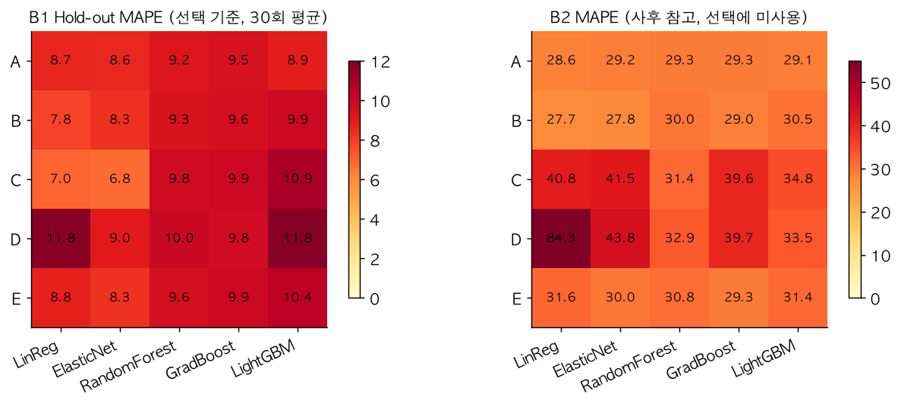
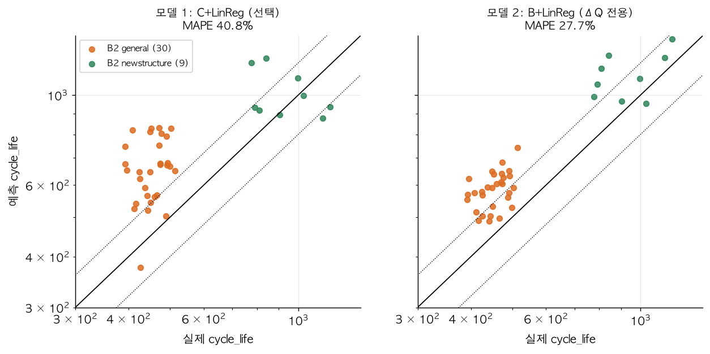

# ESS 배터리 수명 예측

ESS(전력망 배터리)의 교체 시점을 사전에 계획하기 위해, **초기 100 사이클 데이터만으로 배터리의 총 수명(`cycle_life`)을 예측**한다.
배터리 교체 비용은 ESS CAPEX의 30~40%를 차지하므로, 수명을 미리 알면 교체 시점 계획과 제조 직후 불량 셀 선별이 가능하다.

## 프로젝트 개요

- 데이터셋 : MIT-Stanford Battery Dataset (Severson et al., Nature Energy 2019)
- 학습 데이터 : Batch 1 (2017-05-12)
- 평가 데이터 : Batch 2 (2018-02-20)
- 태스크 : **Regression** (Cycle Life 예측, 타깃 log10 cycle_life, 지표 MAPE)
- 분할 : 프로토콜 단위 Hold-out (같은 충전 프로토콜 셀이 train/valid로 갈리는 누수를 막기 위함)

> ⚠️ **논문과의 비교 조건이 다르다.** 논문의 Batch 2는 2017-06-30 파일이고, 논문의 학습/Primary test는 Batch 1과 그 배치를 합쳐 **홀짝으로 나눈** 셀이다
> (공식 코드 `Load Data.ipynb`의 `train_ind`/`test_ind`). 과제 지정 Batch 2(2018-02-20)는 논문 배치에 없다.
> 따라서 논문 9.1%와의 Gap(Target−Test)은 **같은 조건의 달성 목표가 아닌 참고 지표**로 해석한다.

## 핵심 결과

| 구분 | 모델 1 (선택: 피처 세트 C + 선형 회귀) | 모델 2 (ΔQ 전용: 피처 세트 B + 선형 회귀) | 비고 |
|---|---|---|---|
| Train (Batch 1 CV) | 7.0 | 7.8 | 프로토콜 단위 GroupKFold(5) out-of-fold |
| Valid (Batch 1 Hold-out) | 7.6 | 8.0 | 프로토콜 단위 Hold-out (시드 42) |
| **Test (Batch 2)** | **40.8** | **27.7** | 39셀, 최종 모델 1회 평가 |
| Gap (Train-Valid) | 0.6 | 0.2 | (+): 과적합 의심 |
| Gap (Valid-Test) | 33.2 | 19.7 | (+): 배치 간 일반화 저하 |
| Gap (Target-Test) | 31.7 | 18.6 | Target: 원논문 9.1% (비교 조건이 달라 참고) |
| ↳ Test: B2 일반 30셀 | 46.7 | 29.2 | 기존 구조 셀 |
| ↳ Test: B2 newstructure 9셀 | 21.2 | 22.6 | |

지표는 MAPE(%)이며 Gap은 (+)가 나쁜 방향이다 (`Valid−Train`, `Test−Valid`, `Test−9.1`).

**한 줄 요약** 배터리 **안**(Batch 1)에서는 7~8%로 잘 맞히지만, **다른 배치**(Batch 2)로 가면 크게 무너진다 (27.7~40.8%).
원인은 모델이 아니라 **배치 간 이동** — 같은 충전 프로토콜(4.8C(80%)-4.8C)의 수명이 B1 753, B2 484로 다르다. B1 내부 검증으로는 이를 감지할 수 없다.

## 파일 구조

```
├── data/
│   └── README.md             # 데이터 받는 법, 캐시 만들기, 셀 처리 규칙 (원본·캐시는 저장소에 없음)
├── notebooks/                # 실행된 상태로 저장된 노트북 (분석 로직은 src/ 에 있다)
│   ├── 01_EDA.ipynb          # EDA 5개 질문, 배치 비교
│   ├── 02_feature_engineering.ipynb   # 피처 세트, B1 내부 안정성 선별, VIF
│   └── 03_modeling.ipynb     # 파이프라인 실행, 성능표, 오류 분석, ESS 해석
├── src/
│   ├── config.py             # 경로·상수·셀 처리 규칙·플롯 설정
│   ├── preprocess.py         # .mat(HDF5) -> 분석용 캐시
│   ├── features.py           # ΔQ(V), summary 피처, 충전 프로토콜 파싱
│   ├── data.py               # 셀 단위 테이블, 피처 세트, 학습 풀(라벨 정책)/테스트셋
│   ├── split.py              # 프로토콜 단위 Hold-out / GroupKFold
│   ├── feature_selection.py  # B1 내부 안정성 선별(세트 E), VIF
│   ├── models.py             # 후보 모델 + 프로토콜 GroupKFold 하이퍼파라미터 탐색
│   ├── evaluate.py           # MAPE, 편향, 외삽 플래그, Gap 성능표
│   ├── train.py              # 후보 탐색 -> 선택 -> 평가 파이프라인
│   ├── report.py             # 모델링 그림, 오류 분석 요약
│   ├── eda/                  # Day 1 EDA 스크립트 (q1~q5)
│   └── analysis/             # 민감도·보조 분석 (라벨 처리, 부호 안정성, B1 내부 외삽 검증, Day 1 사전 점검)
├── results/
│   ├── model_performance.csv       # 성능표
│   ├── candidates_holdout.csv      # 후보 25개 B1 Hold-out 성능 (선택 근거)
│   ├── candidates_b2_reference.csv # (사후 참고) 후보 25개의 B2 성능 — 선택에 사용하지 않음
│   ├── error_analysis_b2.csv       # B2 셀별 예측/오차/외삽 플래그
│   ├── sensitivity_labels.csv      # 학습 라벨 처리별 민감도
│   ├── selected_model.json, feature_stability_train.csv, shift_check_b1.csv
│   ├── eda/                        # EDA 중간 산출물
│   └── figures/                    # EDA(q1~q5) · 모델링(m1~m4) 그림
├── requirements.txt
└── README.md
```

## 환경 설정

```bash
git clone https://github.com/ddaaann2-jpg/ess-battery-life-prediction
cd ess-battery-life-prediction
python -m venv .venv && source .venv/bin/activate
pip install -r requirements.txt            # macOS: LightGBM 용 `brew install libomp`

# 원본 .mat 4개를 data/raw/ 에 두거나 ESS_RAW_DIR 로 위치를 지정 (data/README.md 참고)
python -m src.preprocess                   # 캐시 생성 (~3초)
python -m src.train                        # 파이프라인 실행 (~1분) -> results/
python -m src.report                       # 모델링 그림
jupyter notebook notebooks/                # 노트북
```

## EDA

가이드의 5개 질문을 Batch 1·2·3에 대해 모두 수행하고 배치 간 특징을 비교했다 (`notebooks/01_EDA.ipynb`).

- **Cycle Life 분포** — 배치마다 분포가 다르다 (중앙값 B1 842 / B2 472 / B3 1,006). B2는 72%가 500 사이클 미만이다.
  B2는 일반 30셀(392~514)과 `newstructure` 9셀(777~1,186)이 섞여 있다. 550 기준 분류는 B1 학습 단수명이 1개뿐이라 성립하지 않아 **Regression**을 택했다.
  - 핵심 발견: 분포 이동이 있고, 배치 효과와 셀 구조 효과가 겹친다 (`newstructure`는 B2 9셀·B3 44셀뿐).
- **열화 곡선** — knee 이후 열화가 약 10배 가속되고 knee는 수명의 약 75% 지점이라 초기 예측에는 쓸 수 없다.
  초기 QD 기울기와 수명의 상관은 B1에서만 유의하다(+0.61, B2 −0.25, B3 +0.19).
  - 핵심 발견: 용량 총량·기울기 피처는 배치 간 이식이 어렵다.
- **ΔQ(V) 곡선** (Q₁₀₀(V) − Q₁₀(V)) — 초기 QD는 겹쳐도 ΔQ(V)는 갈린다. `log Var[ΔQ]`와 수명의 상관은 B1 −0.88 / B2 −0.71 / B3 −0.80.
  - 핵심 발견: 세 배치에서 같은 방향인 가장 강한 신호는 `log Var[ΔQ]` (B2는 집단 구분 효과 포함: 일반 −0.38, newstructure −0.17).
- **충전 속도(C-rate)와 수명** — B1에서는 "빠를수록 짧다"(평균 C-rate와 −0.61)지만 B2·B3는 모든 프로토콜이 10분 충전이라 평균 C-rate가 거의 상수다.
  같은 4.8C(80%)-4.8C가 B1 753 / B2 일반 484 / B2 newstructure 872 / B3 1,564로 배치마다 다르다.
  - 핵심 발견: 프로토콜 → 수명 관계가 배치마다 다르다. 같은 프로토콜 셀은 수명이 비슷하므로(프로토콜 내 CV 6.1·7.1% vs 간 22.7·39.9%) 분할 단위는 프로토콜이어야 한다.
- **상관관계·다중공선성** — |r| ≥ 0.9 피처 쌍 11개, 22개 전체 VIF 최대 6,488. 세 배치 부호가 같은 피처 중 |ρ| ≥ 0.5를 유지하는 것은 ΔQ 계열 3개뿐이다.
- **추가 확인** — B1 8·10·12·13·22번은 EOL에 도달하지 못한 셀이라 제외했고(논문 코드의 제외 목록과 동일), 0~4번은 라벨이 하한값이라 모델 학습에서 뺐다(36셀).

## Modeling

### 피처 엔지니어링 전략

초기 사이클(2~100)에서 셀 단위 피처를 만든다 (`src/features.py`, `notebooks/02_feature_engineering.ipynb`).
핵심은 **`log10 Var[ΔQ(V)]`** — 전압 구간별 용량 변화의 분산으로, EDA에서 세 배치 모두 수명과 같은 방향(−0.71~−0.88)이었다.

| 세트 | 구성 | 근거 |
|---|---|---|
| A | `log Var[ΔQ]` | 핵심 피처 1개 |
| B | ΔQ 통계 3종 (Var, min, mean) | 같은 계열이라 상관 0.98~0.99 → 규제 모델로 처리 |
| C | A + QD 기울기(91~100), 전환 SOC, Tmax, ΔQ 첨도, 초기 용량 | Day 1 EDA에서 고른 보조 피처 (B2·B3 EDA를 참고했다는 한계) |
| D | 전체 후보 15개 | 다중공선성 확인용 |
| E | **학습 데이터 내부**에서 프로토콜 서브샘플링으로 부호가 안정적인 피처만 선별 | C의 한계를 보완 (매 분할 안에서 새로 선별해 검증 셀이 섞이지 않음) |

제외: 평균 C-rate·충전시간(B2에서 반전), ΔQ 왜도·QD 기울기(2~100)(B1에서만 유의), IR 계열(약함, 6셀 결측).
전처리(log10 변환, 표준화, 결측 대체)는 모두 학습 데이터에서만 계산한다.

### 모델 선택 및 근거

- 후보 모델 : 선형 회귀, Elastic Net, Random Forest, Gradient Boosting, LightGBM (딥러닝은 학습 셀 36개라 제외)
- 후보 25개 = 피처 세트 5개 × 모델 5개. **Batch 1의 프로토콜 단위 Hold-out을 시드를 바꿔 30회 반복**해 평균 MAPE로 비교한다.
  하이퍼파라미터 탐색도 학습 데이터 안의 프로토콜 GroupKFold로만 한다.
- 선택 규칙 : 최고 성능의 1 표준오차 이내인 후보 중 가장 단순한 것 (피처 수 → 모델 복잡도).
- **Batch 2는 모델 선택에 사용하지 않는다.** 선택된 모델을 B1 36셀 전체로 재학습해 B2에 1회 평가한다.
- 최종 모델 :
  - **모델 1 = 피처 세트 C + 선형 회귀**: 전체 후보 중 B1 Hold-out이 가장 좋은 쪽 (Valid 7.6%).
  - **모델 2 = 피처 세트 B + 선형 회귀**: Day 1에서 먼저 정한 "ΔQ 핵심 피처(A·B)로 시작" 전략 안에서 같은 규칙으로 선택.
- 선택 이유 : 표본이 작고(36셀) 피처 간 상관이 높아 단순한 선형 모델이 B1 안에서 가장 안정적이었다.

### 성능 결과

위 [핵심 결과](#핵심-결과) 표 참고. 분할 구조는 `results/figures/m1_split_protocols.png`.

- **Gap (Train-Valid) ≈ 0.2~0.6%p** — B1 안에서는 과적합이 거의 없다 (프로토콜 단위로 분리했는데도 Valid가 Train과 같은 수준).
- **Gap (Valid-Test) +20~33%p** — B1 안에서 7~8%인 모델이 B2에서 28~41%가 된다. 배치 간 일반화 문제다.
- **Gap (Target-Test) +19~32%p** — 논문 9.1%에 미치지 못하지만, 논문은 B1과 논문 B2를 홀짝 분할한 셀로 평가했으므로 같은 조건의 목표가 아니다.



**핵심 발견: B1 내부 검증은 배치 이동을 감지하지 못한다.** B1 Hold-out이 가장 좋다고 한 모델 1(세트 C)은 B2에서 ΔQ 전용 모델 2보다 오히려 나쁘다.
세트 C·D에는 전환 SOC·Tmax 같은 **충전 프로토콜 계열 피처**가 있는데, B1 프로토콜 안에서는 수명과 잘 맞지만 B2에서는 프로토콜 → 수명 관계가 달라 일반화되지 않는다.
(B2 열은 선택 후 참고용으로만 계산했다 — `results/candidates_b2_reference.csv`.)
B1 안에서 수명이 가장 짧은 프로토콜을 빼고 학습하는 외삽 검증도 해봤지만 세트 C가 오히려 가장 좋았다(`results/shift_check_b1.csv`) → 문제는 수명 범위의 외삽이 아니라 배치 간 관계의 이동이다.

### 오류 분석



모델이 가장 크게 틀린 셀의 공통점:

1. 상위 오차 셀은 **전부 B2 일반 셀**이고 실제 수명이 가장 짧은 구간(392~477)이다. 모델 1은 실제보다 65~100% 길게 예측한다.
2. 오차가 거의 한 방향(과대 예측)이다 → 무작위 노이즈가 아니라 **체계적 편향**이다 (MAPE ≈ 부호 있는 오차).
3. 그 셀들의 `log Var[ΔQ]`는 학습 범위 **안**에 있는 경우가 대부분이다 (상위 8개 중 6개). 오히려 범위 안 셀 22개의 오차(46.1%)가 범위 밖 17개(34.0%)보다 크다.
   → 원인은 외삽이 아니라 **"같은 ΔQ 값에서도 B2 일반 셀이 B1보다 수명이 짧다"**는 셀 수준의 이동이다.
4. newstructure 9셀은 두 모델 모두 21~23%로 상대적으로 낫다.

**원인 가설**(현 데이터로 검증 불가): 배치별 셀 로트·측정 조건 차이 (초기 용량 평균 B1 1.082 / B2 1.095Ah).

**개선 방향**: ① 새 배치마다 소량의 참조 셀(수명 레이블)로 재보정, ② ΔQ 신호를 초기 용량으로 정규화하는 등 셀 상태를 상대화한 피처, ③ 프로토콜 계열 피처는 같은 배치 안에서만 사용.

학습 라벨 처리 민감도(`results/sensitivity_labels.csv`): 36셀 기본, 원 라벨 41셀, 논문 코드의 `add_len`으로 보정한 41셀을 비교하면 B2 MAPE가 모델 1은 40.8 / 49.5 / 44.5%, 모델 2는 27.7 / 33.8 / 25.7%다.
집단마다 방향이 달라 어느 쪽이 항상 낫지는 않다. 36셀을 기본으로 한 이유는 외부 상수가 필요 없고 검열된(하한값) 라벨을 정확값처럼 쓰지 않기 때문이다. 단점은 학습 최대 수명이 1,074로 낮아진다는 점이다.

## ESS 도메인 해석

**어떤 의사결정에 쓸 수 있는가**
- *교체 시점 계획* — 초기 100 사이클의 ΔQ(V) 신호로 수명 규모를 가늠해 교체 CAPEX를 사전에 계획한다.
  같은 배치(같은 셀 로트) 안에서는 B1 Hold-out 수준(약 7~8%)의 정밀도를 기대할 수 있다.
- *제조 직후 불량 셀 선별* — `log Var[ΔQ]`가 큰 셀(수명이 짧을 가능성)을 초기에 걸러 팩 구성을 최적화한다.

**한계와 실 배포를 위한 추가 요건**
- **배치 간 일반화가 약하다.** 새 셀 로트가 들어오면 같은 ΔQ에서도 수명이 달라질 수 있다 (B2 일반 셀 과대 예측 +29~46%).
  실제 운영에서는 새 로트마다 소량의 보정 데이터(참조 셀 수명)로 **재보정**해야 한다.
- 학습 범위 밖 입력(Var[ΔQ]가 학습 범위를 벗어난 셀)에는 **외삽 경고 플래그**를 달아 사람이 판단하게 한다 (`src/evaluate.py`의 `extrapolation_flag`).
- 표본이 작다(36셀, 20개 프로토콜). 프로토콜 계열 피처는 배치가 같을 때만 유효하므로 신뢰하지 않는다.
- 이 결과는 과제 지정 Batch 2 기준이며 논문 9.1%와 같은 조건의 비교가 아니다.

## 재현성 메모

- 모든 난수는 시드를 고정했다 (`src/config.py`, `src/split.py`). 반복 Hold-out 시드는 0~29, 공식 Hold-out 시드는 42이다.
- Hold-out은 프로토콜 5개를 무작위로 뽑되, 가장 짧은 수명 구간을 대표하는 `5.4C(80%)-5.4C`는 항상 Train에 둔다.
- 피처 선별(세트 C)에는 Day 1 EDA에서 B2·B3를 참고한 정보가 들어 있다. 세트 E는 이 한계를 줄이려고 학습 데이터 안에서만 선별한다.
- `add_len`(= [662, 981, 1060, 208, 482]) 상수는 논문 공식 저장소(`rdbraatz/data-driven-prediction-of-battery-cycle-life-before-capacity-degradation`)에서 가져왔다. `src/analysis/label_sensitivity.py`에 출처 확인 수준을 적어 두었다.

## 참고문헌

- Severson, K. A., Attia, P. M., et al. (2019). Data-driven prediction of battery cycle life before capacity degradation. *Nature Energy*, 4, 383–391.
  https://www.nature.com/articles/s41560-019-0356-8
- 공식 코드: https://github.com/rdbraatz/data-driven-prediction-of-battery-cycle-life-before-capacity-degradation

## 팀 구성

- 김다은 (울산캠퍼스 4반) : EDA, 피처 엔지니어링, 모델 개발, 성능 평가(Batch 2)
